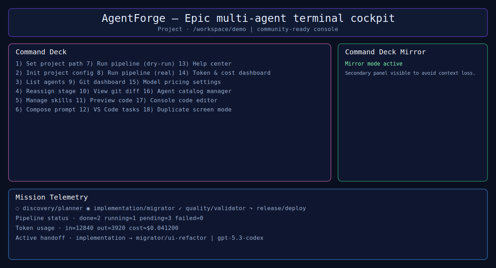
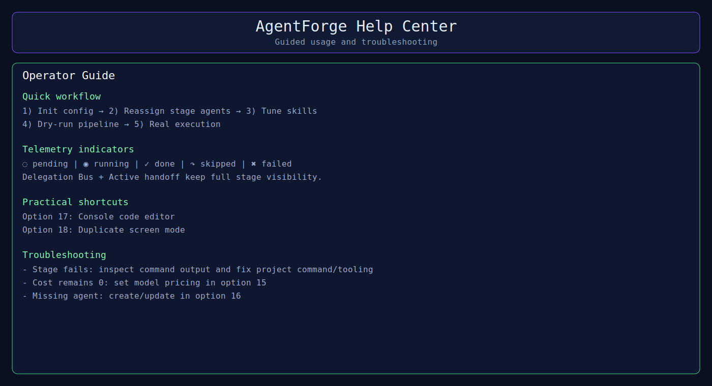
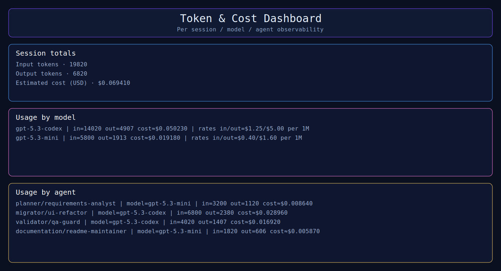

# AgentForge

Epic multi-agent terminal cockpit para coordinar planning, implementación, validación, documentación y release desde una consola visual.

AgentForge combina:
- catálogo de agentes y subagentes
- composición de prompts por skills
- pipelines por stage
- consola ANSI con telemetría de delegación
- utilidades para diff, git y tareas de VS Code

## Highlights
- UI de terminal con paneles y colores
- barra inferior `Delegation Bus` con estado por agente
- `Active handoff` para ver la delegación viva durante el pipeline
- indicadores de progreso por pipeline (`done/running/pending/failed`)
- centro de ayuda integrado en consola (Help Center)
- dashboard de tokens y costo estimado por sesión/modelo/agente
- configuración editable de pricing por modelo (`USD por 1M` + ratio output)
- gestor de catálogo para crear/editar agentes y subagentes
- modo de pantalla duplicada para no perder contexto (mirror command deck)
- editor de código en consola para catálogos/configs (`$EDITOR`/`nano`/`vi`)
- prompts versionables por rol y skills
- instalación simple sin dependencias externas pesadas

## Quick start

### 1. Instalar comandos
Desde la raíz del repo:

- `chmod +x install.sh bin/agentforge bin/agentforge-console`
- `./install.sh`

### 2. Ver catálogo
- `agentforge list-agents`

### 3. Abrir consola
- `agentforge-console --project .`

### 3.1 Funciones avanzadas en consola
- `13` Help center
- `14` Token & cost dashboard
- `15` Model pricing settings
- `16` Agent catalog manager
- `17` Console code editor
- `18` Duplicate screen mode

## Console walkthrough (capturas)

### Dashboard principal + telemetría + mirror mode

### Help center (guía operativa)

### Token & cost dashboard

### 4. Inicializar un proyecto
- `agentforge init . --template full-delivery`

### 5. Probar pipeline
- `agentforge run . --dry-run`

## Estructura
- `bin/`: launchers públicos
- `orchestrator/`: motor del pipeline y consola interactiva
- `prompts/`: prompts base
- `skills/`: capacidades incrementales
- `profiles/`: combinaciones reutilizables
- `scripts/`: utilidades internas
- `templates/`: plantillas de apoyo

## Comandos principales
- `agentforge list-agents`
- `agentforge init <project> --template full-delivery`
- `agentforge compose-agent --agent planner --subagent task-breakdown`
- `agentforge run <project> --dry-run`
- `agentforge vscode-link <project>`
- `agentforge-console --project <project>`

## Observabilidad y costos
- Los costos son estimados en base a prompts compuestos.
- Tokens estimados con aproximación por longitud de texto.
- Para costos reales, configura tus tarifas en consola (opción `15`).

## UX de consola (elegante y práctica)
- Indicadores de estado en todo momento para evitar pérdida de contexto.
- Mirror mode para pantallas duplicadas cuando necesitas comparar secciones.
- Edición directa en terminal de archivos clave como en un flujo tipo editor.

## Casos de uso
- Migraciones Flutter y UI refactors
- Pipelines locales de validación
- Coordinación multi-stage para repos personales
- Demos de delegación de tareas con agentes especializados

## Publicación en GitHub
Este repo ya quedó listo para compartirse:
- licencia MIT
- `CONTRIBUTING.md`
- launchers públicos `agentforge`
- estructura portable sin depender de rutas privadas

## Roadmap sugerido
- temas de color configurables
- export de sesiones a Markdown
- soporte para plantillas de proyecto por stack
- dashboard TUI con navegación por teclas

## Licencia
MIT
